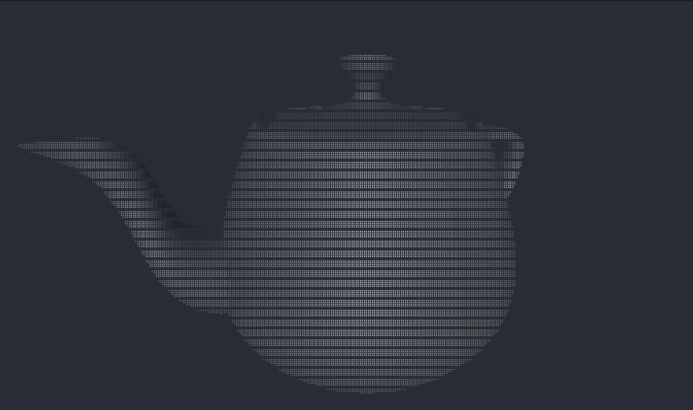
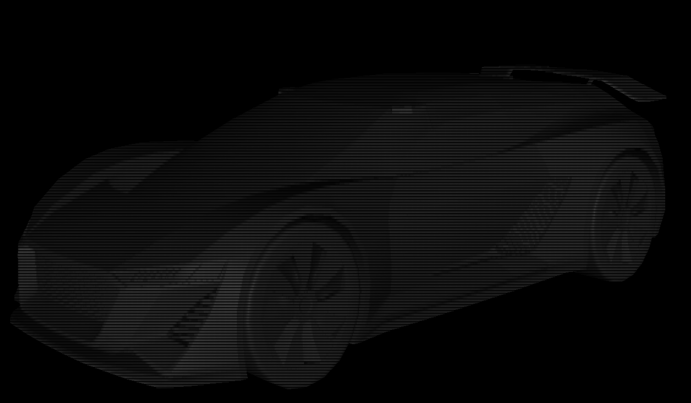

# Glyph GL

CLI приложение для рендера 3D моделей формата Wavefront OBJ.

## Студентам ИУ7

_Выполнено в рамках КуР ИУ7 по дисциплине «Компьютерная графика»._

Согласно [лицензии](LICENSE) копировать можно только с сохранением её текста и, соответственно, автора, поэтому
    взять этот проект как курсовую работу себе — плохая идея.

Зачем я выкладываю в открытый доступ?

1. Занимательный проект, который реально можно использовать в личных целях. 
Я постарался сделать его хоть сколько удобным (флаги, минимальная документация, вменяемый интерактивный режим).
В проект были вложены определённые силы, не хотелось бы, чтобы это лежало мёртвым грузом на диске.
2. Возможность разобраться в одном из вариантов реализации конвейера рендеринга.
Присутствует некоторая декомпозиция, комментарии нетривиальных моментов, отсутствие нейрослопа.

И да, РПЗ здесь нет.

## Установка

```bash
cargo install --path .
```

## Использование

Запустить просмотр модели в интерактивном режиме:
```bash
glyph-gl examples/teapot.obj
```

Сгенерировать один кадр:
```bash
glyph-gl -s model.obj
```

Другие полезные флаги (полный список `glyph-gl --help`):
- `-W`, `-H` — задать ширину и высоту кадра. 
  По умолчанию используется размер терминала.
- `--no-culling` — отключить backface culling, который может некорректно работать для сложных незамкнутых моделей.
- `-p x,y,z` — задать начальную позицию камеры (x, y, z).
- `-t x,y,z` — задать точку взгляда камеры (x, y, z).
- `--max-fps` — задать ограничение количества кадров.
- `--show-fps` — показывать счётчик кадров в режиме реального времени.

> [!IMPORTANT]
> Модель автоматически масштабируется, чтобы умещаться в куб [-1, 1]^3.
> Это стоит учитывать при указании координат в флагах.

## Примеры рендеров

### Чайник

Модель: [examples/car.obj](examples/car.obj) со стандартным для экрана автора разрешением терминала 190x46.
```bash
glyph-gl -W 190 -H 46 -p 0.6,0.4,1.2 -t 0,-0.05,0 -s examples/teapot.obj
```


### Спорткар

```bash
glyph-gl -W 634 -H 139 --fov 20 examples/car.obj
```

Модель: [examples/car.obj](examples/car.obj) с разрешением терминала 139x634 
    (фактическое разрешение изображения 556x1268).


## Технологии, алгоритмы

- Индексный способ хранения полигонов модели, подобная формату Wavefront OBJ.
- Автоматическое вычисление нормалей граней двумя методами:
  - по одной вершине на грань (для flat shading);
  - по одной нормали на вершину как средняя от нормалей смежных граней (для smooth shading).
- Модель закраски по Фонгу (интерполяция нормалей). Достигается flat shading за счёт дублирования нормалей вершин.
- Модель освещения по Фонгу (с бликами). Для параметра `--light-specular 0` вырождается в модель освещения по Ламберту.
- Отсечение по bounds, по нормалям (backface culling), простейший z-buffer.

## Контакты

- [t.me/zhikhkirill](https://t.me/zhikhkirill).
